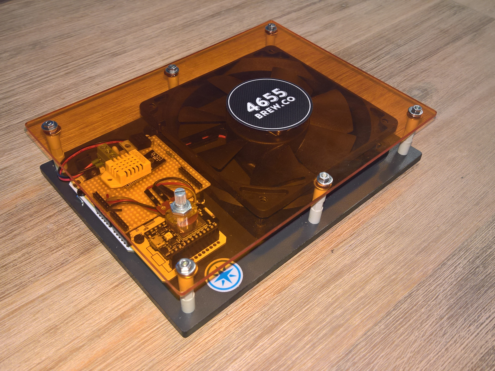

# 4655BrewCo StirPlate

A stir plate with a twist. It packs a DHT22 which reads temp and humidity. It has a manual and auto mode through Particle Cloud.
This allows to publish the temp and humidity to Particle Cloud and automatic speed control of the fan as well.

## Getting Started

These instructions will get you a copy of the project on your local machine for development and testing purpose.

### Prerequisites

#### Particle CLI

The Particle CLI is required to compile, and deploy the project.

    npm install -g particle-cli

#### Visual Code

Install VS Code by following the instructions [here][vs-code].

##### Extensions

Install the following extensions to Visual Studio Code

- [C/C++][vs-code-cpp]

## Development

To develop, open the folder in Visual Studio Code and hack along. Once ready to compile, simply hit CTRL-SHIFT-B. To publish, hit CTRL-SHIFT-P, select Task compile and it will be published to the Core.

## Built With

- [Particle Cloud][particle]

## Versioning

We use [SemVer][semver] for versioning. For the versions available, see the [tags on this repository][project-tags].

## License

This project is licensed under the MIT License - see the [LICENSE][project-license] file for details.

## Acknowledgments

- [Hackster.io - Use Visual Studio Code for your Particle Development Needs][hackster-io-howto-vs-code-particle]
- [Particle Docs - Working with projects and libraries][particle-doc-cli-projects]

<!-- Link references -->
[project-tags]: https://github.com/4655BrewCo/4655BrewCoStirPlate/tags
[project-license]: LICENSE
[vs-code]: https://code.visualstudio.com/
[vs-code-cpp]: https://code.visualstudio.com/docs/languages/cpp
[particle]: http://particle.io/
[particle-doc-cli-projects]: https://docs.particle.io/guide/tools-and-features/cli/photon/#working-with-projects-and-libraries
[semver]: http://semver.org/
[hackster-io-howto-vs-code-particle]: https://www.hackster.io/gusgonnet/use-visual-studio-code-for-your-particle-development-needs-9e23bc